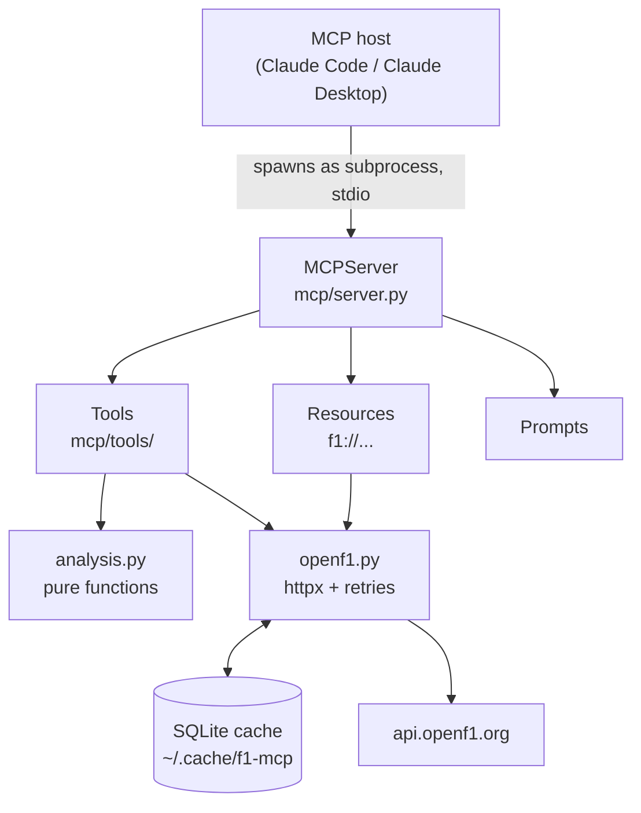

# f1-mcp

## Live server

f1-mcp is deployed on a VPS (Docker + Caddy, automatic HTTPS). Connect any MCP client:

```bash
claude mcp add --transport http f1-mcp https://217-154-7-81.sslip.io/mcp
```

Health check: https://217-154-7-81.sslip.io/health


[](https://github.com/JuanEliasLaraSoto/f1-mcp/actions/workflows/ci.yml)
[](LICENSE)


An MCP (Model Context Protocol) server that lets Claude **analyse Formula 1 races** using
the free [OpenF1](https://openf1.org) API.

Most API wrappers just return data. This one **computes**: race pace, driver consistency,
tyre degradation and strategy, so the model can answer questions like *"Was Leclerc really
faster than Hamilton at Monza?"* with numbers it could not reliably work out on its own.

Every design decision, and why it was made, is logged in [`journal/`](journal/).

## Example conversation

A real exchange in Claude Code with the server connected (excerpt, lightly trimmed):

> **You:** Who was really faster at the 2025 Italian Grand Prix in Monza, Leclerc or Hamilton?
> Use the f1-mcp tools and explain the numbers.
>
> **Claude:** *(called f1-mcp 6 times: sessions, drivers, results, pace comparison and stints,
> for both the race and qualifying)*
>
> Leclerc was faster, by about 0.1–0.2 s per lap on a fair comparison. That's a smaller margin
> than the 11.8 s gap at the flag suggests.

```
                            Leclerc (#16)        Hamilton (#44)       Gap
Qualifying                  P4, 1:19.007         P5, 1:19.124         LEC by 0.117 s
Race result                 P4                   P6                   LEC by 11.8 s
Fastest race lap            1:21.294             1:21.546             LEC by 0.252 s
Mean pace (51 clean laps)   1:23.112             1:23.304             LEC by 0.192 s
Median pace                 1:23.111             1:23.446             LEC by 0.335 s
Same-lap duel (50 laps)     quicker on 34 laps   quicker on 16 laps   LEC by 0.179 s/lap
Consistency σ               0.215 s              0.256 s              LEC steadier
```

> Both ran a one-stop, Medium to Hard, but Hamilton pitted later (lap 38 vs lap 33). [...]
> The lap-by-lap duel is fairer because it compares the same lap number, so fuel loads are
> equal. [...]
>
> Leclerc was faster in qualifying, on outright single-lap speed, over the long Medium stint
> and in consistency. Most of the 11.8 s came from that first stint. On the Hards, Hamilton
> matched him.

Note how the model chooses the lap-by-lap duel over the median gap, because pit-stop timing
skews the median: the tool output and descriptions give it the context to reason about
*which* number to trust.

## What the tools return

Real output for the **2025 Italian Grand Prix** (Monza, `session_key` 9912).

`compare_drivers(9912, 16, 44)` — Leclerc vs Hamilton:

```
Median pace: LEC is 0.335 s/lap faster than HAM.
Lap-by-lap duel (50 comparable laps): LEC faster in 34,
mean gap -0.179 s (negative = LEC faster).
```

`race_strategy(9912)` — the whole grid in one call (excerpt):

```
P1   VER: MEDIUM (1-37) → HARD (38-53) | 1 stop(s): lap 37 (2.3 s stationary)
P2   NOR: MEDIUM (1-46) → SOFT (47-53) | 1 stop(s): lap 46 (5.9 s stationary)
P3   PIA: MEDIUM (1-45) → SOFT (46-53) | 1 stop(s): lap 45 (1.9 s stationary)
...
Most common strategies:
11 driver(s): MEDIUM → HARD
Fastest stop: PIA 1.9 s (lap 45)
```

One call turns hundreds of raw API rows into something the model can reason about — here,
for example, Norris' 5.9 s stop next to Piastri's 1.9 s.

## How the analysis works

| Metric | Method |
|---|---|
| **Clean laps** | Drops lap 1, pit-out laps, laps without a time and laps slower than 107 % of the median (safety car, in-laps, traffic). |
| **Pace** | Fastest, mean and median of clean laps, plus a lap-by-lap head-to-head restricted to laps *both* drivers have clean — same track and fuel conditions. |
| **Consistency** | Standard deviation of the **residuals** after fitting a least-squares line to each stint, with outliers removed via the MAD (3σ, σ = 1.4826·MAD). Raw lap-time spread mostly measures fuel burn and tyre wear, not the driver ([journal 01](journal/01-consistency-on-residuals.md)). |
| **Tyre degradation** | Slope of lap time vs. lap within a stint, reported raw and corrected for fuel burn (~0.055 s/lap). |
| **Strategy** | Compound sequence and pit stops for every driver, most common strategies, fastest stop. |

## MCP primitives

**Tools** — chosen by the model:

| Tool | What it does |
|---|---|
| `list_sessions(year, country?, circuit?)` | Sessions with their `session_key`, the ID every other tool needs |
| `list_drivers(session_key)` | Drivers with their `driver_number` |
| `get_results(session_key)` | Final classification, gaps, DNF / DNS / DSQ |
| `get_laps(session_key, driver_number)` | Lap by lap: time, sectors, pit-out laps |
| `compare_drivers(session_key, driver_a, driver_b)` | Pace, consistency and lap-by-lap duel |
| `get_stints(session_key, driver_number)` | Stints, compounds and tyre degradation |
| `race_strategy(session_key)` | Strategy of the whole grid |
| `ping()` | Health check |

**Resources** — read-only data the user can attach, returned as JSON:
`f1://sessions/{year}` · `f1://session/{session_key}/results`

**Prompts** — templates the user picks from a menu: `analyze_race(year, circuit)` ·
`driver_duel(year, circuit, driver_a, driver_b)`. Each one tells the model which tools
to chain and what to watch out for (e.g. *pace is not the same as final position*).

## Architecture



- **stdio transport**: the host launches the server locally; no network port, no auth.
- **SQLite cache**: OpenF1's free tier allows 3 requests/s and 30/min, and a single question
  can chain several tools. Past sessions never change, so responses are cached forever
  ([journal 02](journal/02-sqlite-cache-and-retries.md)).
- **Retries and friendly errors**: 429s are retried with exponential backoff; timeouts and
  server errors become a readable message instead of a stack trace.

## Setup

Requires Python 3.12+ and [uv](https://docs.astral.sh/uv/).

```bash
git clone https://github.com/JuanEliasLaraSoto/f1-mcp.git
cd f1-mcp
uv sync
```

Register it with Claude Code:

```bash
claude mcp add f1-mcp -- uv run --directory "$(pwd)" f1-mcp
```

For other MCP hosts, add this to their config:

```json
{
  "mcpServers": {
    "f1-mcp": {
      "command": "uv",
      "args": ["run", "--directory", "/absolute/path/to/f1-mcp", "f1-mcp"]
    }
  }
}
```

No API key is needed: OpenF1's historical data (2023 onwards) is free.

### Try it without Claude

`scripts/try_client.py` is a small MCP client that connects to the server in memory —
the same way Claude would:

```bash
uv run python scripts/try_client.py                          # tools and their JSON schemas
uv run python scripts/try_client.py compare_drivers '{"session_key": 9912, "driver_a": 16, "driver_b": 44}'
uv run python scripts/try_client.py resources                # resources
uv run python scripts/try_client.py prompts                  # prompts
```

## Development

```bash
uv run pytest --cov          # 32 tests, ~95 % coverage (CI fails below 80 %)
uv run ruff check .          # lint
uv run ruff format .         # format
uv run mypy                  # strict type checking
uv run pre-commit install    # run all of the above before every commit
```

Tests never hit the real API: HTTP is mocked with [respx](https://lundberg.github.io/respx/)
and each test gets an empty temporary cache. Resources, prompts and tools are also tested
through a real in-memory MCP client/server session. CI runs tests, ruff and mypy on every push.

## Project layout

```
src/f1_mcp/
├── config.py          API URL, cache path, retries
├── openf1.py          HTTP client: SQLite cache, retries, OpenF1Error
├── analysis.py        pure maths: clean laps, pace, residuals, degradation
├── formatting.py      lap times and gaps
└── mcp/
    ├── server.py      creates the MCPServer and registers everything
    ├── errors.py      friendly_errors decorator
    ├── resources.py
    ├── prompts.py
    └── tools/         sessions.py · laps.py · strategy.py
```

## License

[MIT](LICENSE) © 2026 Juan Lara. Data from [OpenF1](https://openf1.org), an unofficial
project not associated with Formula 1 companies.
